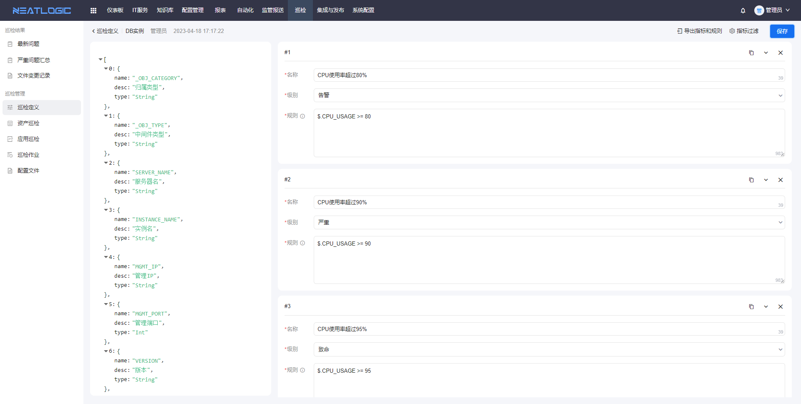
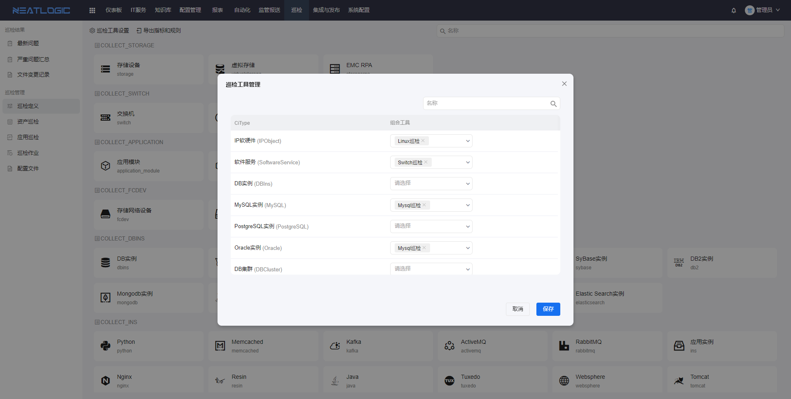
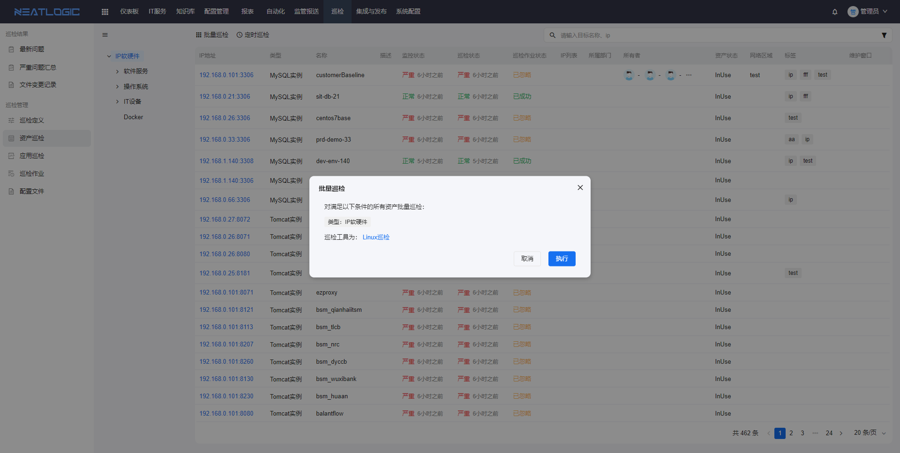
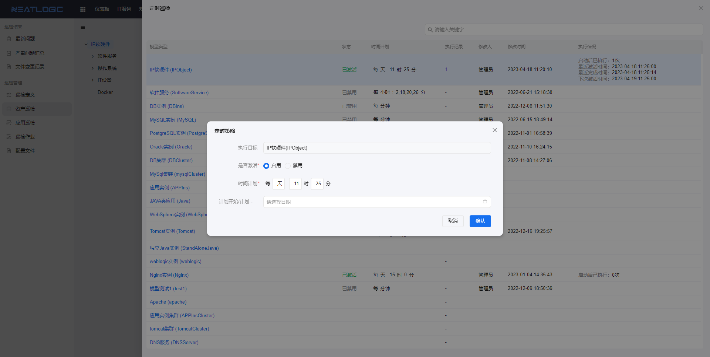
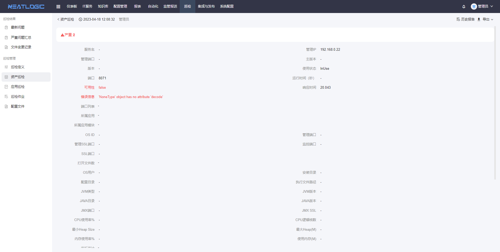
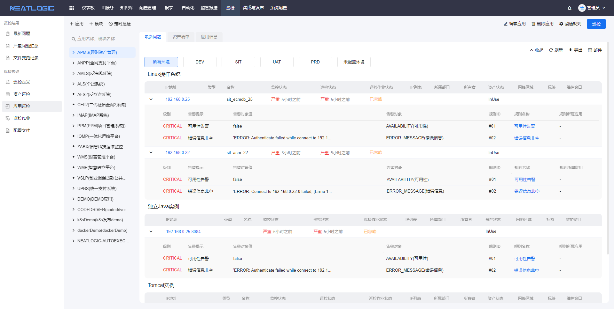
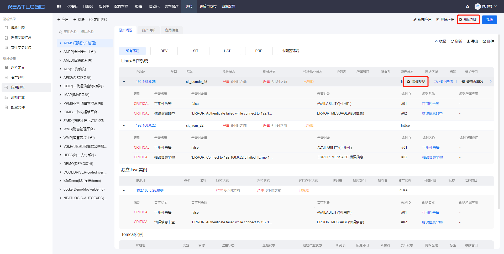
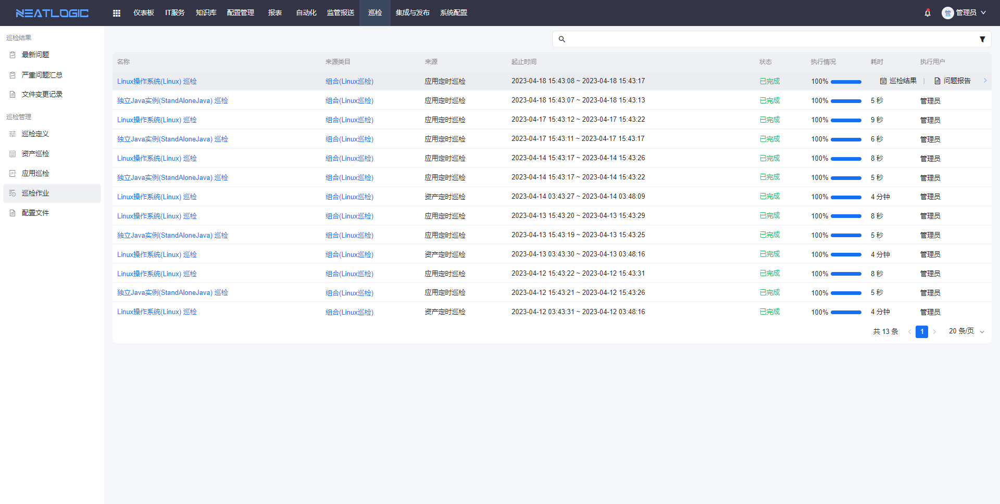
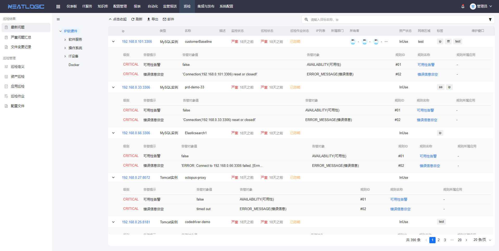

中文 / [English](README.en.md)

    

---

## 关于

neatlogic-inspect是巡检模块，巡检模块可以通过发起巡检作用获取资产各项指标的实时数据，与已设置的指标规则进行对比，并汇总资产问题，主要包括巡检定义、资产巡检、应用巡检和查看巡检结果等功能。
neatlogic-inspect需要自动化模块[neatlogic-autoexec](../../../neatlogic-autoexec/blob/develop3.0.0/README.md)提供支持。

## 主要功能

### 巡检定义

巡检定义的主要功能是管理数据集合的全局指标规则和设置模型巡检工具的页面，支持导出数据集合的指标和规则。

### 资产巡检

资产巡检是对资产执行巡检的页面，巡检的方式包括批量巡检和定时巡检。

- 支持根据需求搜索资产对象，并且以当前搜索结果为批量巡检的巡检范围。
- 支持查看资产的详情
- 支持查看巡检报告
  
- 支持查看巡检作业
- 支持查看资产的阈值规则（指标规则）

### 应用巡检

应用巡检是按应用范围发起巡检的页面，巡检的方式支持应用批量巡检和应用定时巡检。

- 支持添加、编辑和删除应用及模块
- 支持查看应用、模块的最新问题和资产清单
- 支持在应用层重定义阈值规则（指标规则）
  
- 支持查看资产巡检报告
- 支持查看巡检作业
- 支持查看资产的详情

### 巡检作业

巡检作业页面展示所有巡检作业，可根据需求搜索作业，支持查看作业详情和巡检报告。

### 最新问题

最新问题页面是所有资产的巡检结果问题汇总。

- 支持用户根据需求配置过滤条件，并保存为个人分类。
- 支持导出搜索结果中的问题汇总。
- 支持将问题汇总通过邮件发送到指定收件人的邮箱。

## 功能列表

<table border="1"><tr><td>编号</td><td>分类</td><td>功能点</td><td>说明</td></tr><tr><td>1</td><td rowspan="15">巡检管理</td><td rowspan="2">巡检定义</td><td>支持对巡检范围内的巡检插件指标进行阀值定义。</td></tr><tr><td>2</td><td>支持以应用角度配置巡检对象阀值定义。</td></tr><tr><td>3</td><td rowspan="6">应用巡检</td><td>支持以应用系统、应用模块、环境树形结构查看应用巡检资源清单。</td></tr><tr><td>4</td><td>支持以单个应用为巡检单位设置应用的定时巡检。</td></tr><tr><td>5</td><td>支持人工发起单个应用、应用某个模块、应用某个环境进行巡检。</td></tr><tr><td>6</td><td>支持以应用巡检导出应用最新问题列表。</td></tr><tr><td>7</td><td>支持用户以邮件方式推送应用巡检问题列表。</td></tr><tr><td>8</td><td>支持以应用角度导出巡检报告。</td></tr><tr><td>9</td><td rowspan="4">资产巡检</td><td>支持以资产、职能岗位角度查看资产巡检对象。</td></tr><tr><td>10</td><td>支持某类资产定时发起巡检。</td></tr><tr><td>11</td><td>支持单个资产对象手工发起巡检。</td></tr><tr><td>12</td><td>支持单个资产对象导出巡检报告。</td></tr><tr><td>13</td><td rowspan="3">配置巡检</td><td>支持对应用、操作系统、网络配置文件备份内容进行巡检。</td></tr><tr><td>14</td><td>支持在资产清单界面，定义巡检配置文件的路径且支持通配符表达式。</td></tr><tr><td>15</td><td>配置文件发生变更时，自动生成版本，且支持配置文件版本差异在线比对。</td></tr><tr><td>16</td><td rowspan="2">巡检方式</td><td rowspan="2">巡检方法</td><td>提供通用的巡检采集插件，匹配用户实际巡检范围进行巡检。</td></tr><tr><td>17</td><td>支持用户定义脚本方式进行巡检，支持常见的脚本语言，包括Python、Ruby、VBScript、Perl、PowerShell、CMD、Bash、csh、ksh、sh、JavaScript。</td></tr><tr><td>18</td><td rowspan="3">巡检结果</td><td rowspan="3">最新问题</td><td>支持按应用、按资产、按巡检状态、以及其他条件快速查找巡检资产。</td></tr><tr><td>19</td><td>支持按类型快速查看资产的问题列表。</td></tr><tr><td>20</td><td>支持最新问题列表导出。</td></tr><tr><td>21</td><td rowspan="12">巡检范围</td><td rowspan="4">应用巡检</td><td>支持HTTP URL模拟:系统可模拟HTTP请求序列，对请求响应状态、请求时间等相关性能指标进行巡检。</td></tr><tr><td>22</td><td>支持ICMP检测:系统模拟ICMP请求序列，返回系统响应时间等指标。</td></tr><tr><td>23</td><td>支持报文序列检测:系统模拟Socket请求，返回系统响应时间、状态等信息。</td></tr><tr><td>24</td><td>模拟用户访问系统，确认系统可用，同时巡检系统访问和功能使用耗时。</td></tr><tr><td>25</td><td>操作系统巡检</td><td>支持多版本的Windows、Linux、AIX操作系统巡检，采集主机运行状态、CPU、内存、存储、I/O、出入口网络流量等数据。</td></tr><tr><td>26</td><td>虚拟化巡检</td><td>支持vCenter、VMware、华为FusionCompute设备虚拟化巡检。</td></tr><tr><td>27</td><td>中间件巡检</td><td>支持weblogic、Tomcat、Apache、Jetty、WebSphere、tuxedo、Nginx等中间件资源的巡检，采集中间件运行状态。</td></tr><tr><td>28</td><td>数据库巡检</td><td>支持Oracle、MySql、SqlServer、MongoDB、PostgreSQL数据库运行状态等。</td></tr><tr><td>29</td><td>网络巡检</td><td>支持网络交换机、F5服务器、防火墙、专线等网络设备/对象的巡检，采集设备/对象运行状态、资源消耗等数据，覆盖常用网络交换机、防火墙品牌。</td></tr><tr><td>30</td><td>容器巡检</td><td>支持Docker运行容器的健康与性能状态巡检，并且支持对docker容器内的应用进行巡检的能力。</td></tr><tr><td>31</td><td>存储巡检</td><td>存储设备需因具体的客户现场环境而定，IBM DS系列、IBM Flash系列、IBM V7000系列、IBM SVC、IBM FlashSystem 900、EMC RPA、EMC VNX、NetApp、HDS VSP系列、HDS AMS系列巡检。</td></tr><tr><td>32</td><td>服务硬件巡检</td><td>支持对Dell、IBM、浪潮、华为等服务厂商基于带外管理网卡进行服务器硬件巡检。</td></tr></table>